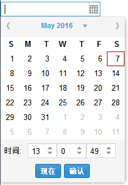

# ExtJS 自定义 datetimefield 控件

[[createDate]]

这一年都在使用 ExtJS 5.0 开发系统，经常会遇到的一个场景就是时间日期的选择了。比如说，预定场地的时候就必须由用户选择预定的日期和时间。

可惜的是，ExtJS 5.0 没有自带一个可以同时选择日期时间的控件（ExtJS 6.0 已经推出了，还没用过，不知道加入这种控件没~），通常偷懒的做法就是，先放一个日期控件，然后再放一个时间控件。用户使用的时候，先选择日期，再选择时间，最后用很别扭的办法将日期和时间拼装起来。

理想的状态是，提供给用户一个可以同时选择时间和日期的控件，并且数据是“日期+时间”的 Date 类型。既符合使用习惯，又方便开发。

故第二种偷懒的方式是，从网上扒一个现成的解决方案来用。此法最快，但是在过程中遇到了一个问题，现成可以搜索到的方案都有点旧，大多数还停留在 ExtJS 2.X、3.X 和 4.X 版本，自从 ExtJS 从 4 升级到 5 之后，API 改变了许多，所以并不能直接使用。

最后只能是自己写一个。准确来说，应该是拿了一份现成的代码修改，这个代码在 ExtJS 5.0 下不能正确运行，但是需要修改的量非常少，所以很感谢这份现成代码的作者，可惜没有署名，不知道是谁。

ExtJS 5.0 上测试成功，实现方法是：

#### 1. 自定义一个时间选择器 TimePickerField，继承自 Ext.form.field.Base，由三个 NumberField 组成。

```
  Ext.define('MyApp.ux.DateTimeField.TimePickerField', {
    extend: 'Ext.form.field.Base',
    alias: 'widget.timepicker',

    alternateClassName: 'Ext.form.field.TimePickerField',

    requires: ['Ext.form.field.Number'],
    inputType: 'text',
    fieldLabel: '时间',
    labelWidth: 40,
    style: 'padding:4px 0; margin: 0; ',
    value: null,
    spinnerCfg: {
      width: 50,
    },

    initComponent: function() {
      var me = this;
      me.value = me.value || Ext.Date.format(new Date(), 'H:i:s');
      me.callParent(arguments);
      me.spinners = [];
      var cfg = Ext.apply({}, me.spinnerCfg, {
  //      readOnly: me.readOnly,
        disabled: me.disabled,
        style: 'float: left',
        listeners: {
          change: {
          fn: me.onSpinnerChange,
          scope: me
          }
        }
      });
      me.hoursSpinner = Ext.create('Ext.form.field.Number', Ext.apply({}, cfg, {
  //      minValue: -1,
  //      maxValue: 24,
          minNum: 0,
          maxNum: 23,
        }));
      me.minutesSpinner = Ext.create('Ext.form.field.Number', Ext.apply({}, cfg, {
  //      minValue: -1,
  //      maxValue: 60,
            minNum: 0,
            maxNum: 59,
        }));
      me.secondsSpinner = Ext.create('Ext.form.field.Number', Ext.apply({}, cfg, {
  //      minValue: -1,
  //      MAXVALUE: 60,
            minNum: 0,
            maxNum: 59,
        }));
      me.spinners.push(me.hoursSpinner, me.minutesSpinner, me.secondsSpinner);
    },

    onRender: function() {
      var me = this, spinnerWrapDom, spinnerWrap;
      me.callParent(arguments);
      spinnerWrap = Ext.get(Ext.DomQuery.selectNode('div', this.el.dom));
      me.callSpinnersFunction('render', spinnerWrap);
      this.el.dom.getElementsByTagName('input')[0].style.display = 'none';
      var newTimePicker = Ext.DomHelper.append(spinnerWrap, {
        tag: 'div',
        cls: 'x-form-clear-left'
      }, true);
      this.setRawValue(this.value);
    },
    _valueSplit: function(v) {
      if(Ext.isDate(v)) {
        v = Ext.Date.format(v, 'H:i:s');
      }
      var split = v.split(':');
      return {
        h: split.length > 0 ? split[0] : 0,
        m: split.length > 1 ? split[1] : 0,
        s: split.length > 2 ? split[2] : 0
      };
    },
    onSpinnerChange: function() {
      if(!this.rendered) {
        return;
      }
      //限制时间范围
      var args = arguments; //this, newValue, oldValue, eOpts
      args[0].setValue( (args[1]>args[0].maxNum) ? args[0].minNum : args[0].value );
      args[0].setValue( (args[1]<args[0].minNum) ? args[0].maxNum : args[0].value );
      this.fireEvent('change', this, this.getValue(), this.getRawValue());
    },

    // 依次调用各输入框函数, call each spinner's function
    callSpinnersFunction: function(funName, args) {
      for(var i = 0; i < this.spinners.length; i++) {
        if( this.spinners[i][funName] != null && this.spinners[i][funName] != undefined ){
          this.spinners[i][funName](args);
        }
      }
    },

    getRawValue: function() {
      if(!this.rendered) {
        var date = this.value || new Date();
        return this._valueSplit(date);
      }
      else {
        return {
        h: this.hoursSpinner.getValue(),
        m: this.minutesSpinner.getValue(),
        s: this.secondsSpinner.getValue()
        };
      }
    },
    setRawValue: function(value) {
      var v = this._valueSplit(value);
      if(this.hoursSpinner) {
        this.hoursSpinner.setValue(v.h);
        this.minutesSpinner.setValue(v.m);
        this.secondsSpinner.setValue(v.s);
      }
    },

    getValue: function() {
      var v = this.getRawValue();
      return Ext.String.leftPad(v.h, 2, '0') + ':' + Ext.String.leftPad(v.m, 2, '0') + ':'
      + Ext.String.leftPad(v.s, 2, '0');
    },

    setValue: function(value) {
      this.value = Ext.isDate(value) ? Ext.Date.format(value, 'H:i:s') : value;
      if(!this.rendered) {
        return;
      }
      this.setRawValue(this.value);
      this.validate();
    },

    disable: function() {
      this.callParent(arguments);
      this.callSpinnersFunction('disable', arguments);
    },

    enable: function() {
      this.callParent(arguments);
      this.callSpinnersFunction('enable', arguments);
    },

    setReadOnly: function() {
      this.callParent(arguments);
      this.callSpinnersFunction('setReadOnly', arguments);
    },

    clearInvalid: function() {
      this.callParent(arguments);
      this.callSpinnersFunction('clearInvalid', arguments);
    },

    isValid: function(preventMark) {
      return this.hoursSpinner.isValid(preventMark) && this.minutesSpinner.isValid(preventMark)
      && this.secondsSpinner.isValid(preventMark);
    },

    validate: function() {
      return this.hoursSpinner.validate() && this.minutesSpinner.validate() && this.secondsSpinner.validate();
    }
  });
```

#### 2. 自定义一个 DateTimePicker，继承自 Ext.picker.Date，实际上就是在原有的 DateField 的基础上增加 TimePicker 和一个确认按键。

```
  Ext.define('MyApp.ux.DateTimeField.DateTimePicker', {
    extend: 'Ext.picker.Date',
    alias: 'widget.datetimepicker',
    requires: ['MyApp.ux.DateTimeField.TimePickerField','Ext.dom.Query'],

    todayText: '现在',
    timeLabel: '时间',
    buttonText: '确定',

    initComponent: function() {
      this.callParent();
      this.value = this.value || new Date();
    },
    onRender: function(container, position) {
      this.callParent(arguments);
      var me = this;


      //确认按键
      var btnCfg = Ext.apply({}, {}, {
        style: 'center',
        listeners: {
          click: {
            fn: function(){
              this.confirmDate();
            },
            scope: me
          }
        }
        });
      me.confirmBtn = Ext.create('Ext.Button', Ext.apply({}, btnCfg, {
        text: '确认',
      }));
      me.confirmBtn.render(this.el.child('div div.x-datepicker-footer'));


      if(!this.timefield) {
        this.timefield = Ext.create('MyApp.ux.DateTimeField.TimePickerField', {
          fieldLabel: this.timeLabel,
          labelWidth: 40,
          value: Ext.Date.format(this.value, 'H:i:s'),
        });
      }

      this.timefield.ownerCt = this;//指定范围
      this.timefield.on('change', this.timeChange, this);//

      var table = Ext.get(Ext.DomQuery.selectNode('table', this.el.dom));

      var tfEl = Ext.DomHelper.insertAfter(table, {
        tag: 'div',
        style: 'border:0px;',
        children: [{
          tag: 'div',
          cls: 'x-datepicker-footer ux-timefield'
        }]
      }, true);
      this.timefield.render(this.el.child('div div.ux-timefield'));

      var p = this.getEl().parent('div.x-layer');
      if(p) {
        p.setStyle("height", p.getHeight() + 31);
      }
    },
    // listener 时间域修改, timefield change
    timeChange: function(tf, time, rawtime) {
      this.value = this.fillDateTime(this.value);
    },
    fillDateTime: function(value) {
      if(this.timefield) {
        var rawtime = this.timefield.getRawValue();
        value.setHours(rawtime.h);
        value.setMinutes(rawtime.m);
        value.setSeconds(rawtime.s);
      }
      return value;
    },
    changeTimeFiledValue: function(value) {
      this.timefield.un('change', this.timeChange, this);
      this.timefield.setValue(this.value);
      this.timefield.on('change', this.timeChange, this);
    },
    setValue: function(value) {
      this.value = value;
      this.changeTimeFiledValue(value);
      return this.update(this.value);
    },
    getValue: function() {
      return this.fillDateTime(this.value);
    },
    handleDateClick: function(e, t) {
      var me = this,
        handler = me.handler;
      e.stopEvent();
      if(!me.disabled && t.dateValue && !Ext.fly(t.parentNode).hasCls(me.disabledCellCls)) {
        me.doCancelFocus = me.focusOnSelect === false;
        me.setValue(this.fillDateTime(new Date(t.dateValue)));
        delete me.doCancelFocus;
        me.fireEvent('select', me, me.value);
        if(handler) {
        handler.call(me.scope || me, me, me.value);
        }
        me.onSelect();
      }
    },
    //确认按键
    confirmDate: function(){
        var that = this;
          that.fireEvent('select', that, that.value);//模拟用户选择
          that.onSelect();
    },
    selectToday: function() {
      var me = this,
        btn = me.todayBtn,
        handler = me.handler;
      if(btn && !btn.disabled) {
        me.setValue(new Date());
        me.fireEvent('select', me, me.value);
        if(handler) {
        handler.call(me.scope || me, me, me.value);
        }
        me.onSelect();
      }
      return me;
    }
  });
```

#### 3. 将 DateTimePicker 装载到 Ext.form.field.Date 中，初始化日期时间的格式。

```
  Ext.define('MyApp.ux.DateTimeField.DateTimeField', {
      extend: 'Ext.form.field.Date',
      alias: 'widget.datetimefield',
      requires: ['MyApp.ux.DateTimeField.DateTimePicker'],
      initComponent: function() {
        this.format = this.format;
        this.callParent();
      },
      format: 'Y-m-d H:i:s',
      createPicker: function() {
        var me = this,
            format = Ext.String.format;
        return Ext.create('MyApp.ux.DateTimeField.DateTimePicker', {
            ownerCt: me.ownerCt,
  //          renderTo: document.body,
            floating: true,
  //          hidden: true,
            focusOnShow: true,
            minDate: me.minValue,
            maxDate: me.maxValue,
            disabledDatesRE: me.disabledDatesRE,
            disabledDatesText: me.disabledDatesText,
            disabledDays: me.disabledDays,
            disabledDaysText: me.disabledDaysText,
            format: me.format,
            showToday: me.showToday,
            startDay: me.startDay,
            minText: format(me.minText, me.formatDate(me.minValue)),
            maxText: format(me.maxText, me.formatDate(me.maxValue)),
            listeners: {
                scope: me,
                select: me.onSelect
            },
            keyNavConfig: {
                esc: function() {
                  me.collapse();
                }
            }
          });
      }
  });
```

将以上代码拷到 ux 当中，调用的时候可以 Ext.create 之，也可以 require 之后直接使用 alias。

效果嘛，就像下图那样：


