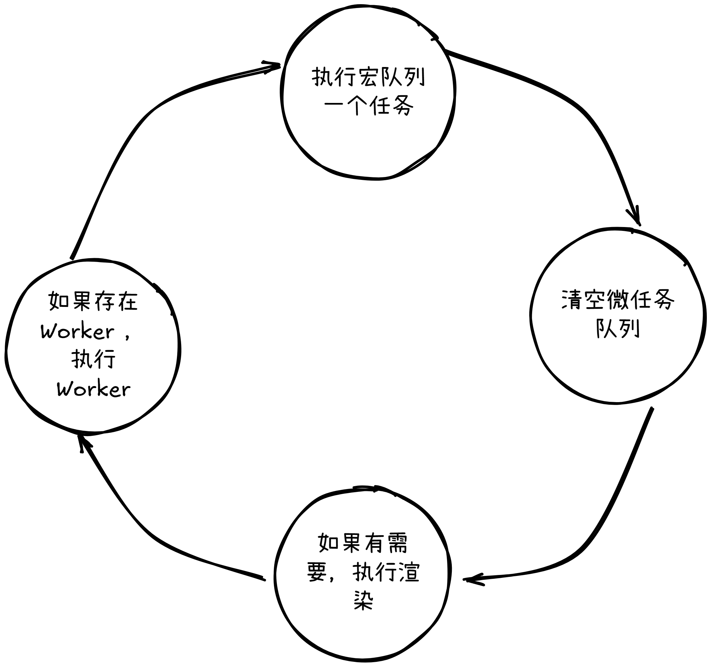

# 浏览器事件循环

[[createDate]]

浏览器事件循环模型和 Node.js 不太一样，Node.js 事件循环使用 libuv 实现，是复杂的多阶段任务队列， I/O 密集型；浏览器比 Node.js 多一个渲染任务，但阶段少，队列比较单一。每个浏览器有不同的解决方案（ Chromium 的 Blink ，Firefox 的 Gecko ），符合 HTML5 规范即可。

## 执行流程

基本执行流程：

## 设计原理与动机

为什么要设计成事件循环模式？浏览器 JavaScript 环境本质上是单线程的，这意味着它一次只能执行一个任务。事件循环机制是为了解决单线程环境下如何处理大量异步操作而设计的。任务类型有轻重缓急，浏览器将事件分成两种优先级，高优先级的称为**微任务**，低优先级的称为**宏任务**。这么设计有几个好处：

1. 任务可以按照不同的优先级处理
2. 既避免空转，又避免渲染阻塞
3. 任务批处理，减少重排和重绘
4. 任务调度灵活，执行顺序可预测

### 常见的**微任务**

- Promise 回调
- MutationObserver
- Object.Observer

### 常见的**宏任务**

- setTimeout / setInterval
- UI rendering
- I/O
- \<script\>
- 用户事件

## 一些疑惑

### HTTP request 属于那种任务？

网络请求属于浏览器 I/O ，有专门的线程处理，属于宏任务。但是 `fetch` 返回是一个 `Promise` ，却是一个微任务。在 `fetch` 以前，网络请求使用 `XMLHttpRequest` 实现，这是一个实实在在的宏任务。

|  任务类型 ​​   |        ​​ 示例         | ​​ 队列归属 ​​ |      ​​ 执行时机 ​​      |
| :------------: | :--------------------: | :------------: | :----------------------: |
| HTTP 请求发起  |       `fetch()`        |     宏任务     |   由浏览器网络线程处理   |
|  Promise 回调  | `.then()` / `.catch()` |     微任务     | 当前宏任务结束后立即执行 |
| 传统 HTTP 回调 |      `xhr.onload`      |     宏任务     |      下一轮事件循环      |
