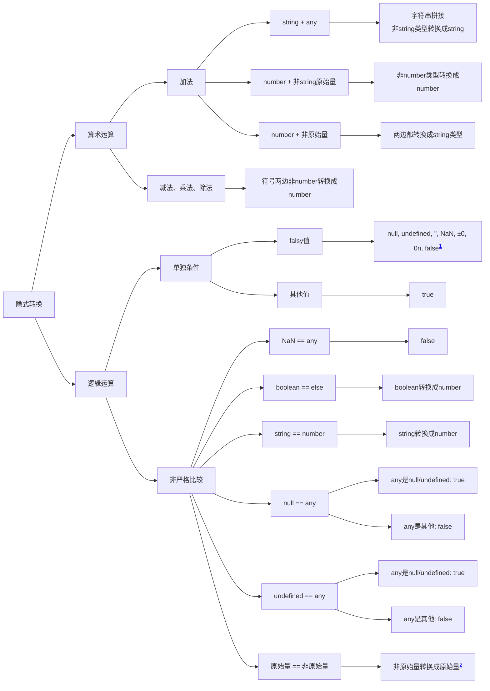

```mermaid
graph LR
  root["隐式转换"] --> 算术运算
  root --> 逻辑运算

  算术运算 --> 加法
  算术运算 --> 其他运算[减法、乘法、除法]

  加法 --> string_add[string + any]
  string_add --> string_add_rule[字符串拼接<br>非string类型转换成string]

  加法 --> number_prim[number + 非string原始量]
  number_prim --> number_prim_rule[非number类型转换成number]

  加法 --> number_nonprim[number + 非原始量]
  number_nonprim --> number_nonprim_rule[两边都转换成string类型]

  其他运算 --> other_ops_rule[符号两边非number转换成number]

  逻辑运算 --> 单独条件
  逻辑运算 --> 非严格比较

  单独条件 --> falsy[falsy值]
  falsy --> falsy_items[null, undefined, '', NaN, ±0, 0n, false<sup><a href="#falsy">1</a></sup>]

  单独条件 --> truthy[其他值]
  truthy --> truthy_rule[true]

  非严格比较 --> nan_eq[NaN == any]
  nan_eq --> nan_eq_rule[false]

  非严格比较 --> bool_eq[boolean == else]
  bool_eq --> bool_eq_rule[boolean转换成number]

  非严格比较 --> str_num_eq[string == number]
  str_num_eq --> str_num_eq_rule[string转换成number]

  非严格比较 --> null_eq[null == any]
  null_eq --> null_eq_true[any是null/undefined: true]
  null_eq --> null_eq_false[any是其他: false]

  非严格比较 --> undef_eq[undefined == any]
  undef_eq --> undef_eq_true[any是null/undefined: true]
  undef_eq --> undef_eq_false[any是其他: false]

  非严格比较 --> prim_nonprim[原始量 == 非原始量]
  prim_nonprim --> prim_nonprim_rule[非原始量转换成原始量<sup><a href="#toPrimitive">2</a></sup>]

  classDef default fill:font-size:1rem,line-height:2;

```
