# PhotoShop 基础--如何抠图

[[createDate]]

抠图是日常图像处理中最常见的一个场景，目的就是将感兴趣的区域从背景当中抽离出来，以便作为他用。背景的定义就是，凡是不感兴趣的区域，都是背景。

## 抠图的一般方法是

1. 拆分区域
2. 提高 感兴趣区域 与 背景 之间的对比度
3. 画出选区
4. 调整边缘
5. 组合

> 注：

> 1. 拆分区域
>
>    在背景复杂的情况下，把图像拆分成若干个背景比较简单的区域，方便勾画选区。
>
> 2. 提高 感兴趣区域 与 背景 之间的对比度
>
>    有很多方法，一般都是通过 选取对比度最高的通道，色阶或曲线调整之后获得高的对比度。这样感兴趣的区域就更容易从背景中区分开来。
>
> 3. 画出选区
>
>    这一步是抠图的关键。对比度高的图像使用一般的选择工具便可画出选区，对比度难以调高时则使用蒙版或者钢笔工具画出选区。
>
> 4. 调整边缘
>
>    对选区进行微调，获得最佳的区域，然后便可抠出感兴趣的区域了。
>
> 5. 组合
>
>    如果对图像进行了拆分，要记得组合回去。

## 快速抠图：

抠图的关键在于感性其（选区）的选取。快速抠图便是在不经过拆分和提高对比度的情况下快速画出选区的抠图方法。感兴趣区域边界简单，例如是个圆形区域或者矩形区域的时候，直接使用选框工具便可画出；如果边界是多种几何形状的组合，或者边界可以明显看出几何形状的情况下，可使用钢笔工具勾选或者使用蒙版涂抹。只要能够将感兴趣区域画出来，用什么方式都是无所谓的。

---

## 名词解释

1. 图层：图像的组成单元。
2. 选区：指在图层上划定的操作范围，由虚线包围。
3. 边缘：指选区与非选区之间的分界区域。
4. 通道：指图像的单原色成分。
5. 色阶/曲线：都是基础的调整工具，就如调整对比度、亮度一类的工具。
6. 钢笔：矢量图作图工具。
7. 蒙版：图层遮挡工具。

工具清单

<table>
  <tbody>
    <tr>
      <td>拆分</td>
      <td>简单的选择工具</td>
    </tr>
    <tr>
      <td>提高对比度</td>
      <td>通道+色阶/曲线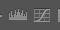</td>
    </tr>
    <tr>
      <td rowspan="3">画出选区</td>
      <td>1.简单的选择工具</td>
    </tr>
    <tr>
      <td>2.蒙版/快速蒙版</td>
    </tr>
    <tr>
      <td>3.钢笔工具</td>
    </tr>
    <tr>
      <td rowspan="2">组合</td>
      <td>1.组合所有可见图层：Ctrl+Alt+E</td>
    </tr>
    <tr>
      <td>2.另存为体积较小的图片格式：Ctrl+Alt+Shift+S</td>
    </tr>
  </tbody>
</table>

## 各式工具位置

（PhotoShop 不同版本按钮位置和外观有些许不同，但大致一致）：

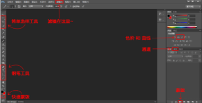

---

## 基础知识

1. 灰度

   灰度是指 **纯粹的白色** 和 **纯粹的黑色** 以及 **从纯白到纯黑之间的过渡**，不包含任何色相（色相一词请参考第二点 HSB）。“黑白照片”其实就是灰度图，不单单只包含黑色和白色两种颜色，所以将黑白照片称作“灰度照片” 更加贴切。

2. HSB

   HSB 是指 **色相(Hues)**、**饱和度(Saturation)**、**亮度(Brightness)**。
   **色相表示什么颜色，饱和度表示颜色有多浓，亮度表示颜色有多亮**。
   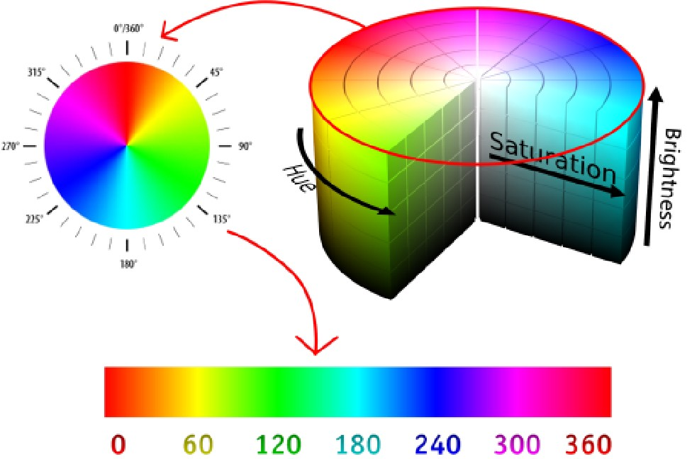

3. RGB

   RGB 是指 **红(Red)**、**绿(Green)**、**蓝(Blue)** 三种基本颜色。由于人眼对这三种颜色特别敏感，并且**这三种颜色相互叠加可以搭配出几乎所有人类可以感知的色彩**，所以选用了这三种颜色作为基本颜色。RGB 色彩模式是工业界的一种颜色标准，几乎所有的显示器都是采用 RGB 色彩标准。
   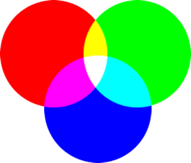

4. CMYK

   和 RGB 用于显示不同，CMYK 色彩模式是用于打印的。CMY 指的是 **青色 Cyan**、**洋红色 Magenta**、**黄色 Yellow** 三种基本打印机油墨颜色，黑色 blacK 不属于基本颜色，囿于工艺的缺陷，打印机油墨总是达不到理想的颜色，三种基本颜色混合得出的颜色暗红，达不到纯粹的黑色，只能靠增加黑色油墨来补充。
   **CMYK 色彩模式下颜色远不如 RGB 模式下丰富，两种模式相互转换时会不可逆转地遗失大量色彩。**在设计印刷物的时候建议采用 CMYK 模式设计，避免打印出来的效果和设计效果相差太远；在设计单纯的显示材料时则推荐 RGB 模式，以获得丰富的色彩。

5. 通道

   2~4 点介绍了 3 中颜色模式，每种模式下都会有三种基本颜色，或称为“**原色**”。**通道即是以图像的每种原色分量绘制的灰度图**。
   用 RGB 模式举个例子。如下图，1、2、3 为 RGB 三原色，1+2 是红色与蓝色的叠加，2+3 是蓝色和绿色的叠加，1+3 是红色与绿色的叠加，1+2+3 是红绿蓝三色的叠加，可以看到，三原色的叠加产生了白色。在通道图里，颜色越接近白色说明该颜色分量的含量远大，所以在 Red 通道里，只要是有 1 的区域都是白色的，说明那些区域都含有充足的红色；类似地，只要有 2 的区域，Blue 通道中都会是白色；只要有 3 的区域，Green 通道中都会是白色。
   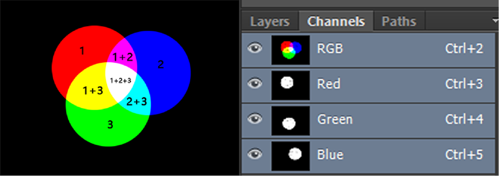

6. 蒙版

   蒙版顾名思义就是“蒙在图层上面的板子”，英文称呼是 mask。**它就像是在图层上面盖上了一层遮挡的板子，镂空的地方可以看见图层，不镂空的地方则是遮罩。**
   使用蒙版可以安全快速地去除掉图层上我们不需要的部分，不需要费力地去删除它们。如果删错了图层的某些部分，就很难再找回来了，蒙版画错了只需要擦掉重来。
   创建蒙版的按键在图层栏的最底部，单击蒙版按键，将会在当前图层上新建一个蒙版。蒙版类似于灰度图：在蒙版上，黑色表示遮挡，白色表示透明，介于黑白之间的灰度表示半透明。直接拿黑色的画笔工具在蒙版上涂画即可，画错了的地方用橡皮擦擦掉，或者用白色的笔再涂一遍即可。
   注意，操作蒙版的时候应该先确认激活了蒙版而不是图层，如果激活了图层，则在图层缩略图上会有一个白色的框，表示其可操作；类似地，如果激活的是蒙版，则在蒙版缩略图上会有一个白色的框。

   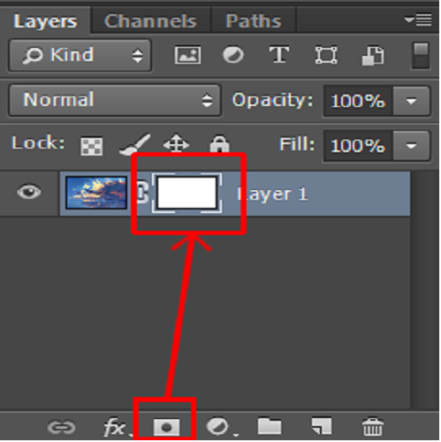

   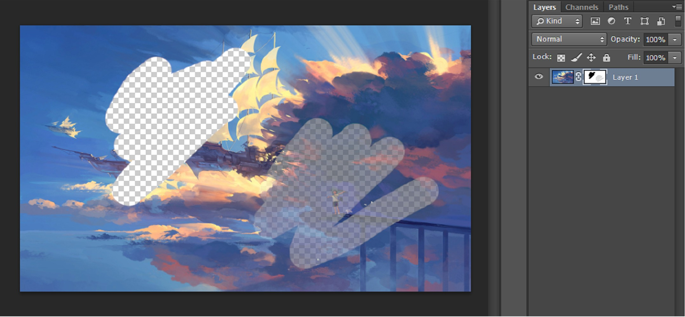

7. 直方图

   **直方图是用来统计各种亮度像素点数目的工具。**它是一幅表征各灰阶像素点数量的柱状图。在灰度图中，255 表示白色，0 代表黑色。下图是某张灰度图的直方图，横轴是灰阶 0, 1, 2, 3, …, 255，纵轴表示图像中某个灰阶像素点的数量，0~1 并不是绝对数量，而是相对数量：如下图，灰阶为 74 一点像素数量最大，那么这一点的数量取为 1，其余点按照灰阶为 74 一处的像素数量为准，计算出相对数量。

   

   直方图可以清晰地反映出图像的明暗程度。当图片太暗，说明大部分像素点灰阶都比较低，直方图会大量偏左；当图片太亮，说明大部分像素点灰阶都比较高，直方图会偏右；当图片亮度适中的时候，直方图应该大多数分布在中间。

   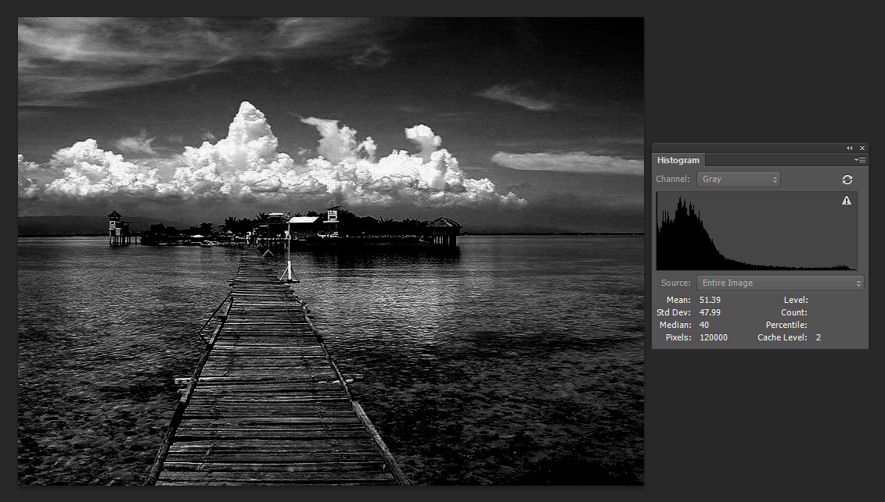

   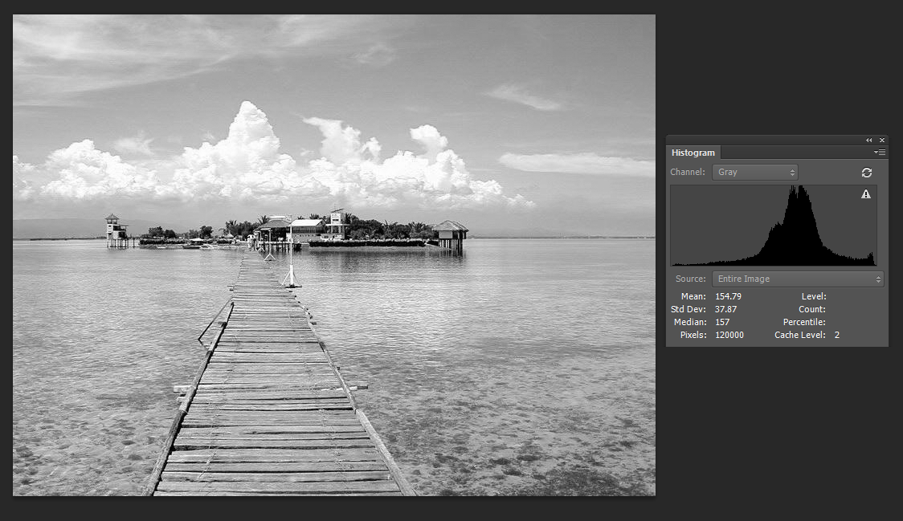

   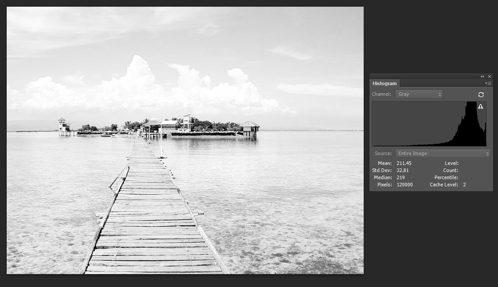

8. 色阶与曲线

   色阶指的是图像的亮度，与颜色无关。调节色阶，可以改变图像整体明暗程度，也可以单独改变明亮区域和黑暗区域，使对比度提高。下面一图用来说明色阶的用法：

   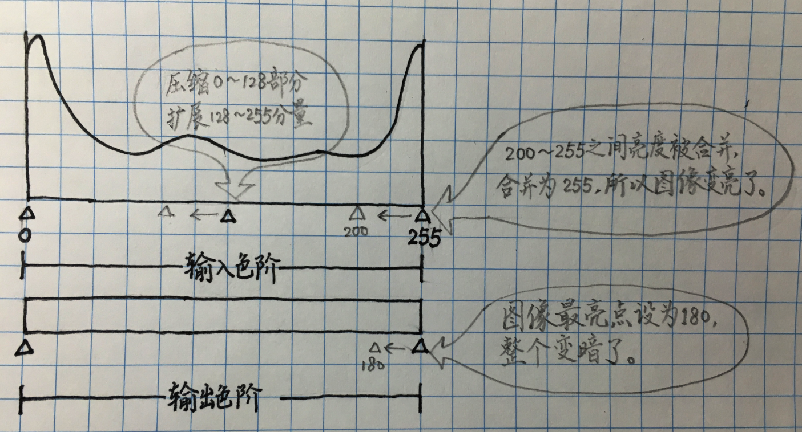

   曲线同样也是亮度的调节工具。与色阶相同的是，曲线可以调整图像整体的亮暗程度，并且使用曲线可以获得更加自然的输出；与色阶不同的是，曲线可以操作单独一种亮度的像素，调节更加灵活。下面一图用来说明曲线的用法：

   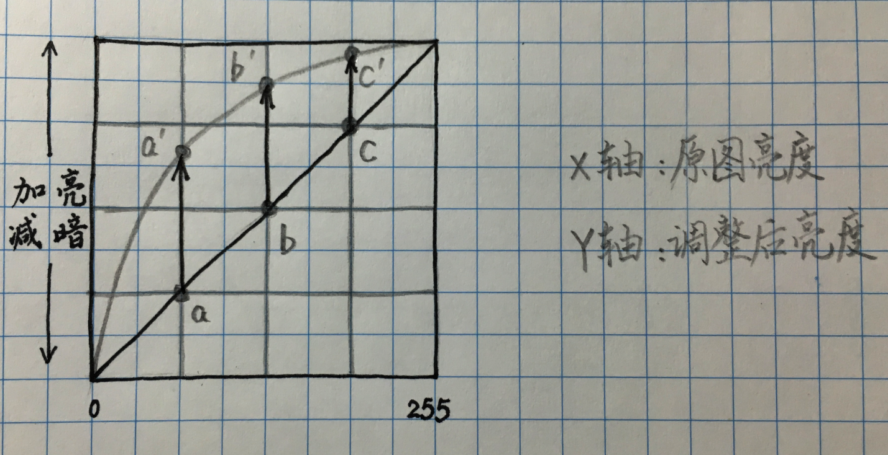

9. 钢笔工具与贝塞尔曲线

   钢笔工具是 PhotoShop 中的矢量作图工具。矢量图中的线条都是用数学方法计算出来的，没有像素和像素密度的概念，在显示的时候是靠计算作图，所以无论如何放大缩小都不会产生锯齿（即不会有马赛克状的模糊）。
   PhotoShop 在绘制矢量曲线是贝塞尔曲线。贝塞尔曲线由法国工程师皮埃尔·贝塞尔（Pierre Bézier）在 1962 年提出的。对贝塞尔曲线感兴趣的话可以参考这篇文章： http://www.cnblogs.com/cbscan/articles/3035541.html 。
   使用钢笔工具描边是最准确的，而且操作起来也最简单。在图像上点两个点就可以确定出一条直线，在点上进行转换就可以得到曲线，曲率由控制点调整。总结起来就是：直线画两点，曲线勤转换。
   这里有一个钢笔工具的趣味练习，感兴趣的话可以玩玩看：http://bezier.method.ac 。
