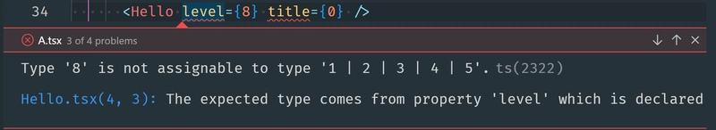
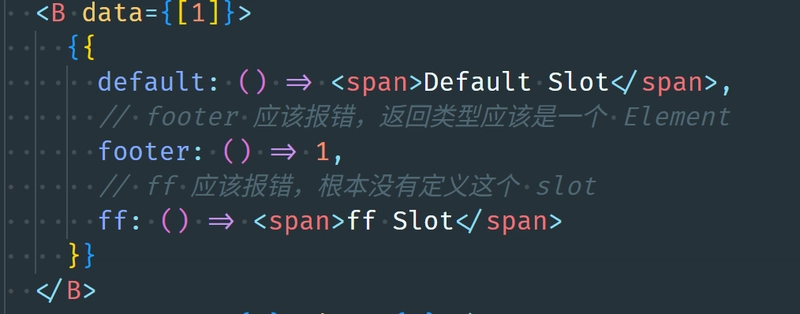
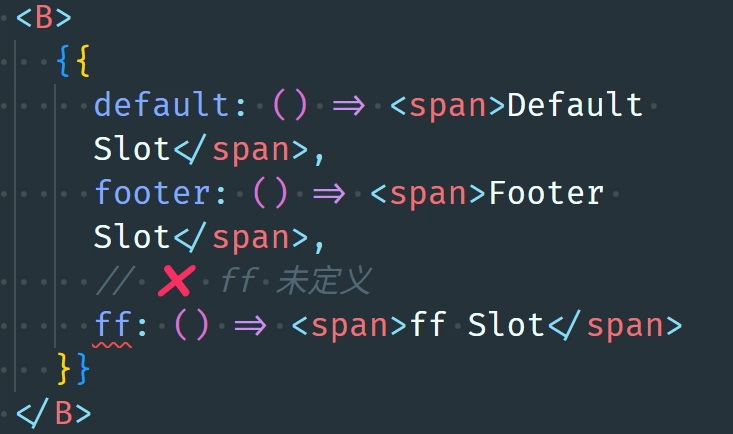
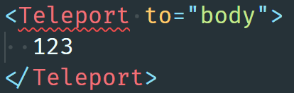

# 如何为 Vue 组件提供 slots 静态类型检查

**2025/05/28**

使用 TypeScript + jsx 编写 vue 组件的前提下

[[toc]]

## 1. 使用 jsx 语法编写 vue 组件

除了 template 语法，vue 组件也是可以用 [jsx](https://vuejs.org/guide/extras/render-function#jsx-tsx) 来编写的。 jsx 最初是 Facebook 为 React 开发的一种 JavaScript 扩展，因为上手容易，越来越多人使用，以至于其他 web 框架也开始支持这种 JavaScript 方言。其实 jsx 还有一个优势，容易添加类型，也就是所谓的 tsx 。 所有将模板编译成类似 `createElement()` 函数的前端框架都理应支持 jsx 语法，vue 也不例外，早在 2.x 的版本就已经支持 jsx 了，vue2 template options 的写法对一些灵活场景非常不友好，有时候还是会使用 jsx 或者叫 `render function` 的函数来实现（例如 ant-design-vue Modal.method()）。

vue3 新增了 `setup` 函数，使得 jsx 不仅仅可以在 render function 中编写，也可以在 setup 的返回值中实现。render function 将组件的状态、逻辑实现方法、生命周期钩子和组件结构隔离得比较远，设计 composite 的其中一个意图就是要拉近状态、逻辑、生命周期和组件结构的距离，所以在 vue3 中使用 jsx 语法时，建议在 setup 中实现而不是 render function。一个简单的对比：

```javascript
// vue2
Vue.component("Hello", {
  render: function (h) {
    return h("h" + this.level, this.title);
  },
  props: {
    level: {
      type: Number,
      required: true,
    },
    title: {
      type: String,
      required: true,
    },
  },
});
```

```jsx
// vue3
import { ref, h } from "vue";

export default {
  props: {
    level: {
      type: Number,
      required: true,
    },
    title: {
      type: String,
      required: true,
    },
  },
  setup(props) {
    return () => h("h" + props.level, props.title);
  },
};
```

## 2. 为 vue 组件添加一些静态检查

vue2 对 ts 的支持比较糟糕， 所以无论是 template 还是 `render function` ，都是在写 JavaScript ，对于复杂大型的项目来说比较难受。 vue3 增强了 TypeScript 支持，无论是新的 template setup 写法还是传统的 options 写法，都提供了丰富的类型推断支持。过去 props 类型检查只有运行时检查，比如定义一个组件的时候，使用 props 属性定义接口：

```javascript
props: {
  title: {
    type: String;
  }
}
```

传入 data 类型如果不是一个 String 实例，那么就会在浏览器 console 里面获得一个 warn 。这是一种不怎么优雅的方案，缺少静态检查，测试不充分的情况下传错类型的问题很容易出现。 在 vue3 只需要对上面的代码进行一点点小改造便可以获得良好的类型检查：

```typescript
props: {
  title: {
    type: String as PropType<string>;
  }
}
```

其中 `PropType` 是 vue 提供的一个工具类型（Utility Type），在静态检查过程中为组件 props 提供类型检查。例如定义一个组件 Hello ：

```tsx
import { defineComponent, h, PropType } from 'vue';

export const HelloProps = {
  level: {
    type: Number as PropType<1 | 2 | 3 | 4 | 5>,
    required: true
  },
  title: {
    type: String as PropType<string>,
    required: true
  }
} as const;

export default defineComponent({
  name: 'Hello',
  props: HelloProps,
  setup(props) {
    return () => h(
      `h${props.level}`，
      props.title,
    );
  }
});
```

在使用 Hello 的时候，如果没有传入正确的参数，会获得错误提示：



这就好多了，优雅且安全。既然 props 可以增加 ts 类型声明，那 slots 也必须可以的吧？翻看[文档](https://vuejs.org/api/sfc-script-setup.html#defineslots)，vue3 提供了一个名为 `defineSlots` 的函数，接受一个 slots 类型的泛型输入，可以为 template 组件提供 slots 类型支持。

```vue
<script setup lang="ts">
const slots = defineSlots<{
  default(props: { msg: string }): any;
}>();
</script>
```

另外[文档](https://vuejs.org/api/options-rendering.html#slots)也提到使用 defineComponent 定义组件时，可以像定义 props 一样，使用工具类型 `SlotsType` 为 Object 对象提供 ts 标注：

```tsx
defineComponent({
  name: "B",
  slots: Object as SlotsType<{
    default: () => JSX.Element;
    footer: () => JSX.Element;
  }>,
  setup(props, { slots }) {
    return () => <>{slots.default?.()}</>;
  },
});
```

这样，在 setup 中使用 `ctx.slots` 时便可以获得类型提示和静态检查了。一切看起来时那么美好顺利，是吗？

## 3. slots 类型与 tsx 困境

按照 `SlotsType` 的写法，组件内部确实可以获取 slots 类型，但在组件外部却无效。还是以上一段代码为例，组件 B 在使用的时候，可以随意指定 slots 就算类型错误，或者 slot 根本不存在也不会检查出来：



明明已经定义了 slots 类型，为什么不能检查？ template 组件通过 defineSlots 和 <slot /> 组件可以实现的功能，在 tsx 中为什么行不通了呢？更悲观一点的看法，vue3
的 tsx 组件是不是无法对 slots 做静态类型检查呢？

## 4. slots 和 children

解决这个问题首先要搞明白 tsx 是怎么工作的。slots 并不是 vue 独有的用法，在 react 中叫做 children 。children 在 react 组件中被认为是一个 props ， 直观地看这种设置并不是很自然，props 被定义为类似 HTML Attribute 的东西，但 children 显然不是 Attribute 。不过这些不重要，还是来看看 TypeScript 怎么检查 children 的。秘密藏在 tsconfig 文件里面，如果你的项目初始化使用了主流成熟的 CLI 构建，那么在 tsconfig 文件里面一定可以看到 `compilerOptions.jsxImportSource` （react 项目可能没有，preact 、 vue 等非 react 项目一定会有）配置，正是这个配置定义了 tsx 的检查规则。`compilerOptions.jsxImportSource` 指向一个叫 jsx-runtime.js 的文件，通常会伴随一个 jsx-runtime.d.ts 类型描述， jsx-runtime.js 用来告诉 ts 框架的渲染函数是什么，和如何处理 `<Fragment />` 标签，有了这些定义，就可以将混在 js/ts 代码中 XML 标签转换成渲染函数，文件也从 jsx/tsx 格式变成浏览器可以直接使用的 js 文件。你可能注意到了， jsx-runtime.js 是个 js 文件，这就意味着它是用来处理运行时而不是静态检查的，我们想要的静态检查配置在 jsx-runtime.d.ts 类型描述中。 jsx-runtime.d.ts 定义是有规范的，关于 children 规则是这样的：

```ts
declare namespace JSX {
  interface ElementChildrenAttribute {
    children: {};
  }
}
```

从命名上可以看出，ts 将 children 视作是一个 Attribute ，在 ElementChildrenAttribute 中可以重命名 children 属性的名字，react 的做法就是直接使用 children 这个名字：

```ts
interface ElementChildrenAttribute extends React.JSX.ElementChildrenAttribute {}

interface ElementChildrenAttribute {
  children: {};
}
```

看看 vue 提供的 jsx-runtime ，并没有 ElementChildrenAttribute 的定义，那是不是将 vue ElementChildrenAttribute 定义为 slots 就完成任务了呢？

显然没有这么简单。

前面也说过，react 在解析渲染函数的时候，将 children 视作一个 attribute 注入到了 props 中，使用时通过解构 `const {children} = props` 或者直接访问 `props.children` 便可获得内容。vue 的思路不同，并没有将 slots 看作是 attribute ，相应地也没有将 slots 注入到 props 中，如果只是给 `ElementChildrenAttribute` 改名为 slots ，不会在代码中获得任何检查和提示 。

## 5. 解决方案

那是不是就无解了？也不是。这里给出两种可行的解法：

### i. 组件内 props 增加 children 定义

既然 children 指的是注入到 props 的一个属性，那么写得啰嗦一点，把 defineComponent 定义好的 slots 类型原封不动写到 props 中，举个例子，改写一下上文提到的 B 组件

```tsx
interface BSlots {
  default?: () => JSX.Element;
  footer?: () => JSX.Element;
}

export const BProps = {
  children: {
    type: Object as PropType<BSlots>,
  },
};

defineComponent({
  name: "B",
  props: BProps,
  slots: Object as SlotsType<BSlots>,
  setup(props, { slots }) {
    return () => <>{slots.default?.()}</>;
  },
});
```

效果卓群！



那么代价是什么？ vue 没有 children 的概念，在 props 中定义一个不需要也不存在 children 对象，一方面开发者再也不能用这个名字作为 props 了，另一方面 slots 和 children 名字实在是很难联系起来，时间久了可能没人能看懂。聪明的你可能会想到，把 `ElementChildrenAttribute` 改成 slots ，确实可以，这样至少可以解决名称的困扰，但是还是无法解决 props 多写无用代码的缺点。

### ii. 修改 jsx-runtime

方法 i 终究是一些运行时补丁，不好看也不好用，还是要考虑从根源治理这个问题。我们看回 vue jsx-runtime.d.ts 文件

```ts
export interface ElementClass {
  $props: {};
}
export interface ElementAttributesProperty {
  $props: {};
}
```

元素的 attrbute 是被指向到 $props 对象的，如果使用 defineComponent 函数定义组件， $props 最终在 `ComponentPublicInstance` 中被定向到 `InferredProps` ，而 `InferredProps` ，简单地看，也就是定义的时候传入 props 那些 `as PropType<>` 的内容了。答案这不就出来了，在 `InferredProps` 中注入传入的 SlotsType 岂不美哉？

```
export function defineComponent<
  // ... 前面一大堆代码
  ResolvedEmits extends EmitsOptions = {} extends RuntimeEmitsOptions
    ? TypeEmitsToOptions<TypeEmits>
    : RuntimeEmitsOptions,
  // 注入发生在这里，给 InferredProps 增加一个 children 属性，指向 传入的 Slots 定义，当然放到最后面会更好，不会被覆盖
  InferredProps = {children?: UnwrapSlotsType<Slots>} & (IsKeyValues<TypeProps> extends true
    ? TypeProps
    : string extends RuntimePropsKeys
      ? ComponentObjectPropsOptions extends RuntimePropsOptions
        ? {}
        : ExtractPropTypes<RuntimePropsOptions>
      : { [key in RuntimePropsKeys]?: any }),
  TypeRefs extends Record<string, unknown> = {},
  // ... 后面一大堆代码
>
```

效果是一样卓群的，这里就不放图了，参考上一个。

那么这个方法的代价又是什么呢？由于给所有组件**无差别**地注入了 children ，导致所有 vue 内置组件都报错了，原因是 children 类型不匹配：



要修复这个问题也不难，找到所有内置组件的类型定义，在相应的位置加上 children 定义即可，举个 Fragment 组件的例子：

```ts
export declare const Fragment: {
  __isFragment: true;
  new (): {
    $props: VNodeProps & {
      // 加上这一行就行了
      children?: VNodeChild;
    };
  };
};
```

不过这个方法不是官方给出的最终解法，没有经过充分的测试，不是完全可靠。如果你在项目中 100% 使用 defineComponent + tsx 编写组件，这个方案还是特别推荐你去尝试的，如果是 template 写法，那么就没有必要折腾了，官方已经给出最佳方案。
