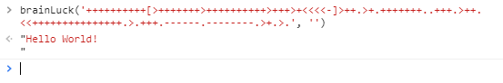

### BrainFuck 解释器

**2018-05-21**

BrainFuck 是一种深奥难懂的计算机语言（=大脑去你的=），1993 年一个叫 Urban Müller 的人发明了这种语言。fuck 是脏话，所以百度百科把 BrainFuck 和谐成了 BrainF\*\*k。

这种语言只有 8 种简单的指令和一个指针。看起来很简陋，但是 BF 也是图灵完备的~平常很少见有人用，一般都是作为程序员的娱乐项目。

8 种指令

| 指令 | 指令含义                                                      |
| :--: | :------------------------------------------------------------ |
| `>`  | 指针加一                                                      |
| `<`  | 指针减一                                                      |
| `+`  | 指针指向的字节的值加一                                        |
| `-`  | 指针指向的字节的值减一                                        |
| `.`  | 输出指针指向的单元内容                                        |
| `,`  | 输入内容到指针指向的单元                                      |
| `[`  | 如果指针指向的单元值为零，向后跳转到对应的]指令的次一指令处   |
| `]`  | 如果指针指向的单元值不为零，向前跳转到对应的[指令的次一指令处 |

数据存储在一个理论上无穷大的字节数组里，每个元素只有 1byte，初始值为 0，编码方式是 ASCII。

举例子：

##### 例一

```
,+.
```

`,` 先读入一个字节，`+` 该字节自加一，`.` 输出该字节

最终就实现从键盘读入一个字节并对这个字节加一，然后输出。假如键盘输入了一个字符'A'，执行指令之后将会输出'B'。

##### 例二

```
,----------[----------------------.,----------]
```

这个程序会把从键盘读来的小写字符转换成大写。按回车键退出程序。

##### 例三

```
++++++++++[>+++++++>++++++++++>+++>+<<<<-]>++.>+.+++++++..+++.>++.<<+++++++++++++++.>.+++.------.--------.>+.>.
```

这一段程序会输出'Hello World!' （你信不信？）。

---

如何构造 Brainfuck 解释器是一件既好玩又有挑战性的事情。作为一个 FE，我用`JavaScript`实现了一个解释器。

利用了`eval()`这个小恶魔~

```js
function brainLuck(code, input) {
  var brainFuck = new fuckObj(),
    result = "",
    inputArr = input.split("");
  eval(
    code
      .split("")
      .map(function (e) {
        switch (e) {
          case ",":
            return "brainFuck.input(inputArr.shift());";
            break;
          case ".":
            return "result+=brainFuck.output();";
            break;
          case ">":
            return "brainFuck.moveright();";
            break;
          case "<":
            return "brainFuck.moveleft();";
            break;
          case "+":
            return "brainFuck.add();";
            break;
          case "-":
            return "brainFuck.minus();";
            break;
          case "[":
            return "while(brainFuck.current()!=0){";
            break;
          case "]":
            return "}";
            break;
          default:
            break;
        }
      })
      .join("")
  );
  return result;
}

function fuckObj() {
  this.data = [0];
  this.i = 0;

  this.moveright = function () {
    // >
    this.i++;
    if (this.data[this.i] == undefined) this.data[this.i] = 0;
  };

  this.moveleft = function () {
    // <
    this.i--;
  };

  this.add = function () {
    // +
    this.data[this.i] = this.data[this.i] == 255 ? 0 : this.data[this.i] + 1;
  };

  this.minus = function () {
    // -
    this.data[this.i] = this.data[this.i] == 0 ? 255 : this.data[this.i] - 1;
  };

  this.input = function (data) {
    // ,
    this.data[this.i] = data.charCodeAt(0);
  };

  this.output = function () {
    // .
    return String.fromCharCode(this.data[this.i]);
  };

  this.current = function () {
    return this.data[this.i];
  };
}
```



信了吧？

---

> quote
>
> [维基百科-BrainFuck](https://en.wikipedia.org/wiki/Brainfuck)
>
> [百度百科-BrainF\*\*k](http://baike.baidu.com/link?url=_s021Jslpg08MTCSG8PdygXdUbPQYqaB0EzOaAJOl1FT1r3mFtG4doxsG1KDaWeP0ISV_24yU8-Mk32KeqHQkaMpv9dvw907eKUAkWWZ-OG)
