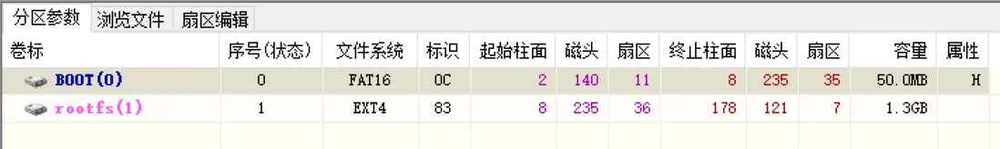
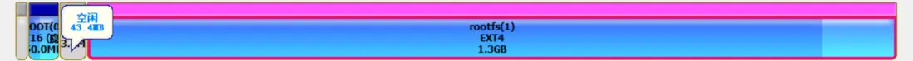
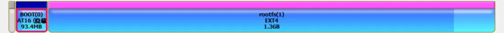
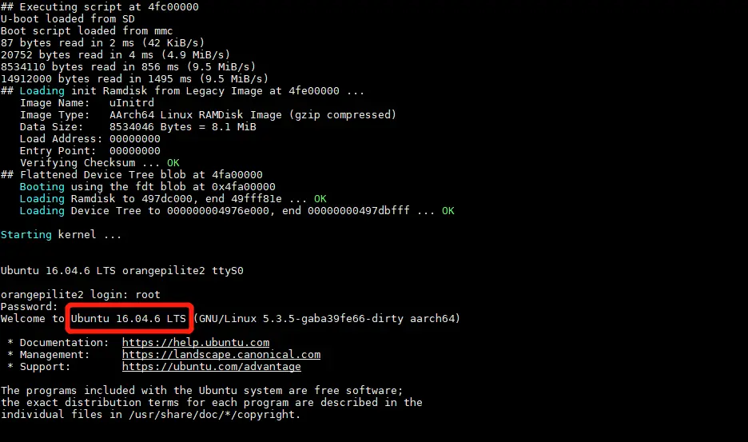
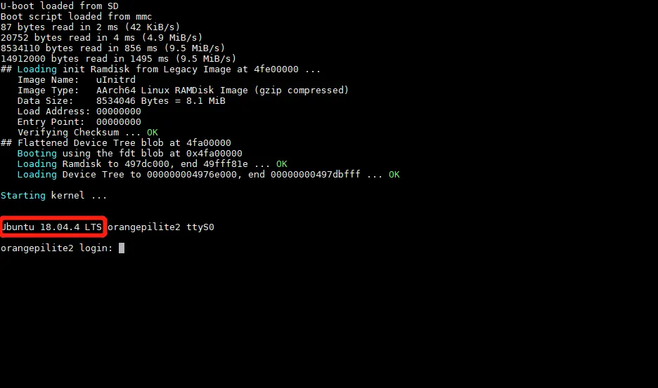

#### 尴尬的场景

**2020-05-03**

OrangePi Lite 2 可玩度很高，性价比也很高，是一款真香机。但香橙官方一直没给出 OrangePi Lite 2 适配的 Ubuntu 18 以上版本的固件，目前最新是 Ubuntu 16 （官方释出了 WIP 版本的 18，还不是 supported），Armbian 适配的 Lite 2 固件又一直没搞定蓝牙和声卡。用来做服务器，官方系统版本太旧，用来做显示，Armbian 蓝牙和声卡又用不了，挺尴尬的。

如果使用 Linux 桌面系统作为娱乐工具，其实还是蛮鸡肋的，因为缺少娱乐服务生态，想看个 4K 的在线视频？不好意思，资源供应商只提供 Windows 和 Mac 两款 PC 版本的客户端，或者 Android 和 iPhone 手机的 app；网页观看？不好意思，最高只有 720p 。。。

所以去解决 Armbian 的驱动显得没有必要，还不如想想怎么把官方提供的 Ubuntu 16 升级到 18。

#### 查找资料

Ubuntu 是支持在线升级系统版本的，依托 Debian 强大的包管理系统，只需要几句`apt`指令就可以完成。

1.  更新源

    ```bash
       sudo apt-get update
       sudo apt-get upgrade
       sudo apt dist-upgrade
    ```

2.  安装 update-manager-core

    ```bash
      sudo apt-get install update-manager-core
    ```

3.  升级

    ```bash
      sudo do-release-upgrade
    ```

    执行了这条命令之后，Ubuntu 会开始进行升级，中间会有很多次询问，是否确定、是否更改设置、ssh 是否覆盖更新，我都选择了 Yes，当然如果不需要更新，也可以选择 No。因为担心中文显示的问题，console 编码我选择自动，没有选择缺省的 拉丁 1 。

#### 遭受挫折

升级方法如此简单，预示着升级过程一定不会很顺利。果然，升级进行到某个阶段的时候，中止报错了。

错误提示是 /boot 分区空间不足，至少需要 80MB ，虽然忘记截图了，但是错误信息我还是记得很清楚。

我翻出了从官网下载的官方 ROM （版本 OrangePi_Lite2_xenial_server_linux4.9_v1.3.img），用磁盘工具分析了一下分区情况：



官方 Ubuntu 镜像只给 /boot 分区分配了 50MB 容量，而`do-release-update`需要至少 80MB 空闲空间，除去 /boot 分区已有的文件，剩余空间肯定不满 80MB，升级失败。

如何扩大 /boot 分区成为了大问题。

#### 思考解法

既然 /boot 分区太小，那么想办法扩容不就好了。


镜像文件有大概 2GB 那么大，我猜测官方在制作这个镜像的时候，假定用户使用的 SD 卡最小就是 2GB 。除了 /boot 分区用了 500MB 以外，磁盘开头还预留了 20MB 空闲，应该是作为 MBR 的引导（我猜的），那么， / 分区就有足足 1.3GB 空间，但实际上 / 分区文件只占用了 88% 左右，我们可以从 / 分区调剂出大概 161.5MB 空间，而且 / 分区和 /boot 分区紧邻，调整起来就更容易了。



实际划拨的是否发现，虽然显示 12% 空闲，但是实际上只能划大概 43MB 出来，足够用了。



最终 /boot 分区获得了 93.4MB 空间，省一省还是刚刚好的。

**友情提示**：修改 .img 镜像文件之前，最好对镜像源进行备份，以免操作失败丢失数据。

#### 升级！

开机。


照着上面说的的方法升级。



就这样子，获得了 Ubuntu 18.04.4 。

#### 留一个坑

调整过分区表的镜像，烧录之后，自带的扩容脚本`resize_rootfs.sh`就无法正常使用了，总会提示扩容失败。这个问题解决起来也不难的，下回再写。
