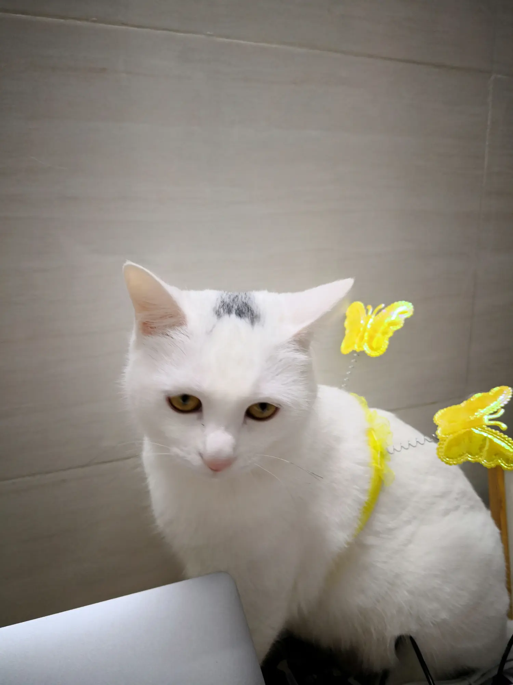
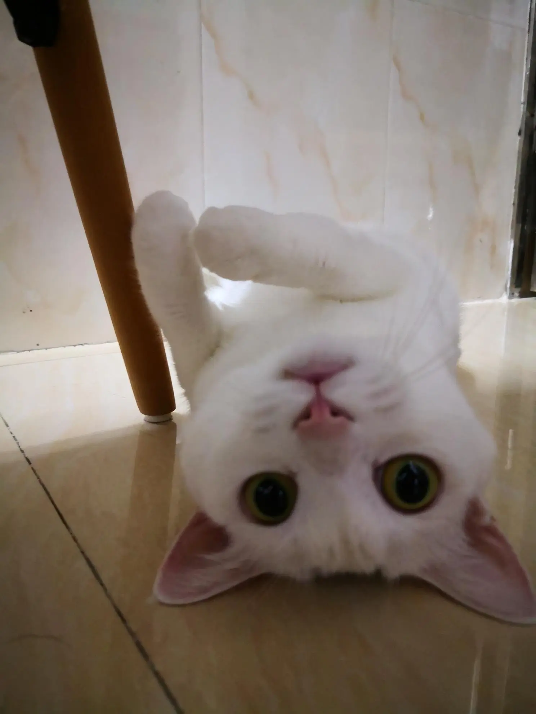
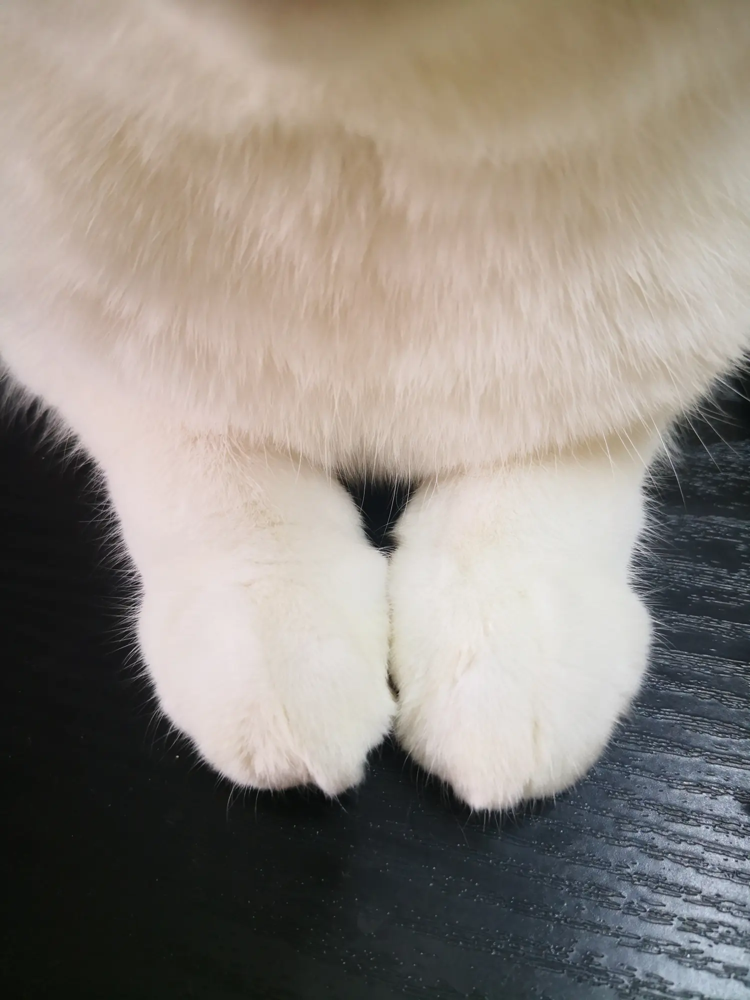
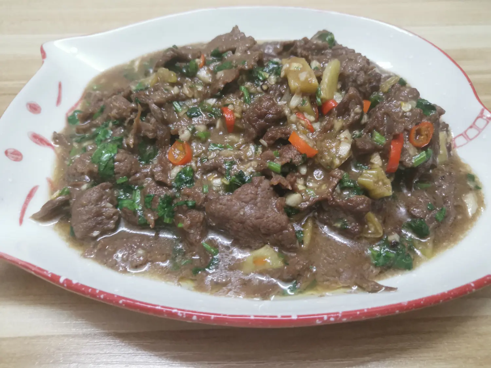

# 我想居然想变老

**2020/11/17**

养猫的好处，就是写东西找不到配图的时候，可以祭出自己家傻猫。

实际上我有两只猫，一只叫做小松，另一只叫做邋遢。上图这只看起来很忧郁的是小松。小松和邋遢是姐妹俩，同一只猫妈妈生的，她俩真实的年龄我其实不知道，只知道来家里的时候都是大概 2 个月大的猫宝宝。根据两只猫当时的体重和牙齿，简单地指定了邋遢是姐姐，小松是妹妹。领养的时候，我要了邋遢，一个朋友要了小松。姐妹俩其实还有一个灰黑色的弟弟，被一个我不认识也没见过的人领养走了。

那为什么现在两只猫都归我了呢？哈哈，因为小松的妈妈在领养猫一年之后成为我的女朋友。

上面这位就是邋遢。

每天在家里的时间，最舒服的时候就是和心爱的人一起喝茶看书撸猫。这种时候总是觉得时间流淌地很平静。小猫咪天生活泼爱动，像小朋友一样，在我们的眼皮底下搞破坏、打架。我经常会像训斥小孩子一样训斥她们。两只猫性格迥异，邋遢比较文静亲人，常常主动跳上大腿求摸摸，对我们带回家的朋友们比较友好；小松是一只领地意识很强的猫，对于陌生人，她是很凶的，会呲牙炸毛，但是对于我俩，却表现得特别柔弱，实际上占有欲又极强，非常想要得到我们的宠爱。有一次我在厅里看书，小松非要跳上桌子，把爪子搭在我的手臂上，我把她抱走，没过多久又回来了，而且变本加厉地把头伸过来挡住书，示意我我给她摸摸。

周末通常是在家时间最长的时候，也是每周最愉快的时候。如果周末在家不外出，我们有时候会自己烧伙做午餐。以前我是不擅长做饭的，在家有老妈做，上学有饭堂做，毕业后单身的时候会偶尔做点东西给自己吃，厨具也有限，终归做的很简单的食物，也算不上好吃；和女朋友一起住之后，总是希望两个人能生活得更好，所以努力地去学习了烹饪。现在已经学会了好几样简单的菜式，而且口味也能达到受人称赞的程度，不得不说，爱情在塑造一个良好的家庭主厨这方面，有着强大且独特的力量。

学了一道湘菜

有时候就在想，如果天天都是休息日，那该多好。可是人不工作不足以养活自己，不奋斗就没有美好生活。这真的是一对不可调解的矛盾啊！如果积攒足够的钱，早日退休的话，是不是就可以尽早地过上这种悠闲的生活呢？哎呀，我居然想着早点变老了。

> 更多猫咪的图片可以访问我的 [instagram](https://www.instagram.com/yangholmes/) 。
